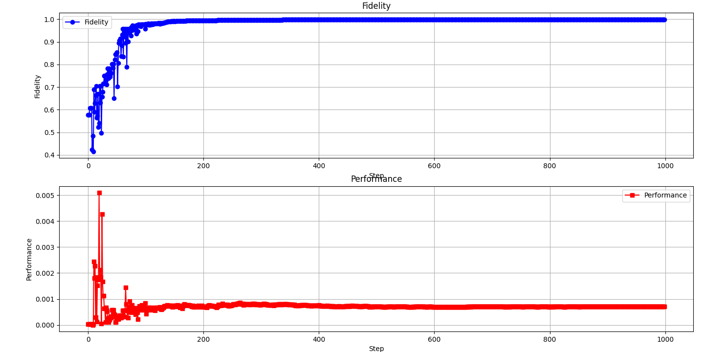
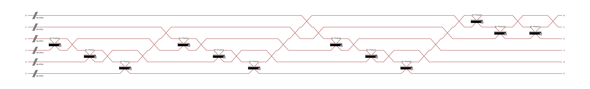
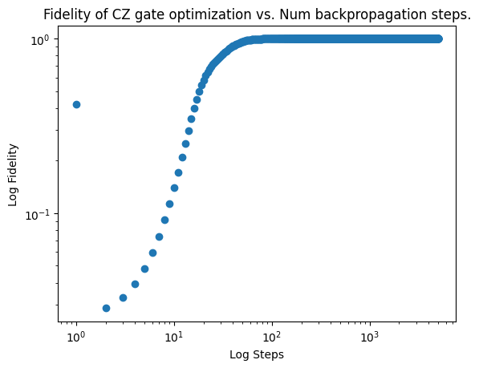
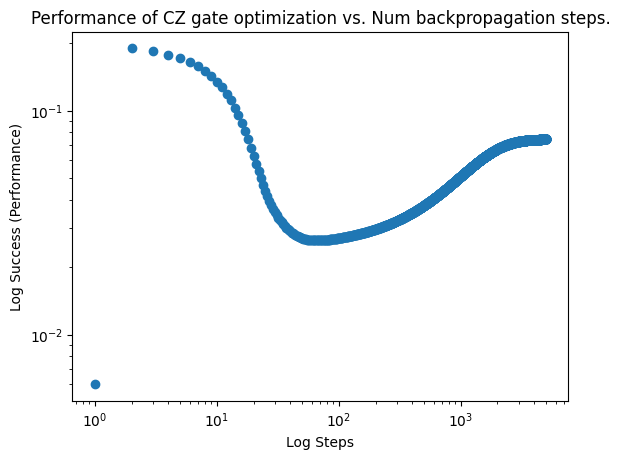

# MIT2024QHackthon

# Team: QuBruin

 
This is the logo for our team.

We are three Master students from UCLA MQST project looking for internship right now.

Please contack us if you are interested.


[UCLA MQST program webpage](https://qst.ucla.edu/)


**Zhuoyang Ye, Yarin Heffes, Roberto Negrin**

This is the solution for 2024 MIT Hackathon.


We choose the remote problem provided by Quandela.
The original Link is here
[Quandela_2024 problem](https://github.com/iQuHACK/2024_Quandela_Remote)

The documentation page of Quandela  that we reference is here

[Quandela documentations](https://perceval.quandela.net/docs/)


# Goal of our contest

We implement the 3-mode linear optical CCZ gate defined as:

$$CCZ\ket{x_1,x_2,x_3}=(-1)^{x_1x_2 x_3}\ket{x_1,x_2,x_3}$$


# Our method and procedure 


1. Learning and reproducing
  - we read the documentation of Quandela and implement all the basic single qubit gates
  - We read the reference papers
  - We repreduce the implementation of CZ gate


2.Design the circuit
   - We understand the circuit design of CZ gate: Pair each of the herald mode with one of the data mode
   - We generalize the method used in designing CZ gate for designing CCZ gate
   - We optimize and modify the design.

     
3.Optimization
   - We try to optimize the CZ gate with scipy
   - Fix the design and number of parameters, we optimize the parameters used in CCZ gate


# Our result


|                 | Fidelity    | Performance    |Photon numbers   |Herald mode numbers   |Score                 |
| :---:           | :---:       | :---:          |:---:            |:---:                 |:---:                 |
| Best result |       0.9999999972040188   | 0.00013705153692927373            | 6             |3                  |-0.028765559400252796                   |


## Training loss

The loss function that we choose to minimize is 

$$Loss=10^7 \times \log(2-fidelity)-10 \times \log(performance+1)$$

We use the COBYLA optimizer to minimize the above loss function to get the best parameters. The loss during the training process is plotted in the following figure:




The structure of our CCZ implementation is shown in the following figure:




# Innovation

While we succeeded in demonstrating remarkable fidelity and performance for the CCZ gate using the naïve scipy.optimize approach, we wanted to implement a neural network that implements the procedure as developed in the paper, Uskov et. al. (2008). Our neural network succeeds in reproducing the earleir results for a perfect-fidelity CZ-gate with a performance 2/27, and the architecture is wanting only minor but critical adjustments to achieve similar results for the CCZ gate.

The neural network operates on n data modes and m auxiliary modes. The architect decides an array of pairings for two-mode Rx gates. The neural network will initialize each mode with a different phase, and then, together with the parameters theta for the Rx gates, will produce a (m+n) by (m+n) unitary matrix applied to the modes. 

Then, the procedure from the paper is used to "trace-out" the auxiliary qubits and return the matrix A which is to be compared with a target matrix At, which for our purposes is the CZ or CCZ gate. The network computes the gradient for a more "intelligent" or "physically aware" optimization procedure. The results of the optimization for the CZ gate are shown below, and the judge is encouraged to review the python notebook located TorchSandbox folder. 





The beatiful quality of these plots is that they demonstrate that the neural network "prioritizes" the fidelity, optimizing it first before tuning the performance. 


# Install the required package

In windows:

```console
py -m pip install -r requirements.txt 
```

In Mac, Linux or Ubuntu:

```console
pip install -r requirements.txt 
```

# Run the grader


In windows:

```console
py auto_grader.py
```

In Mac, Linux or Ubuntu:

```console
python auto_grader.py
```
# Reproduce our result

To reproduce our training result, you can run the following command in your own terminal:

In windows:

```console
dir Optimization
py opt_CCZ.py
```

In Mac, Linux or Ubuntu:

```console
cd Optimization
python opt_CCZ.py
```


**Note**: One of the team members spiled Coke on his laptop during the project, which is in part why we were not able to complente the NN component of our project. We are currently accepting donations for a new computer 🥲

# Reference


[1] Aaronson, S., & Arkhipov, A. (2011, June). The computational complexity of linear optics. In Proceedings of the forty-third annual ACM symposium on Theory of computing (pp. 333-342).

[2] Reck, M., Zeilinger, A., Bernstein, H. J., & Bertani, P. (1994). Experimental realization of any discrete unitary operator. Physical review letters, 73(1), 58.

[3] Clements, W. R., Humphreys, P. C., Metcalf, B. J., Kolthammer, W. S., & Walmsley, I. A. (2016). Optimal design for universal multiport interferometers. Optica, 3(12), 1460-1465.

[4] Knill, E., Laflamme, R., & Milburn, G. J. (2001). A scheme for efficient quantum computation with linear optics. nature, 409(6816), 46-52.

[5] Knill, E. (2002). Quantum gates using linear optics and postselection. Physical Review A, 66(5), 052306.

[6] Uskov, D. B., Kaplan, L., Smith, A. M., Huver, S. D., & Dowling, J. P. (2009). Maximal success probabilities of linear-optical quantum gates. Physical Review A, 79(4), 042326.

